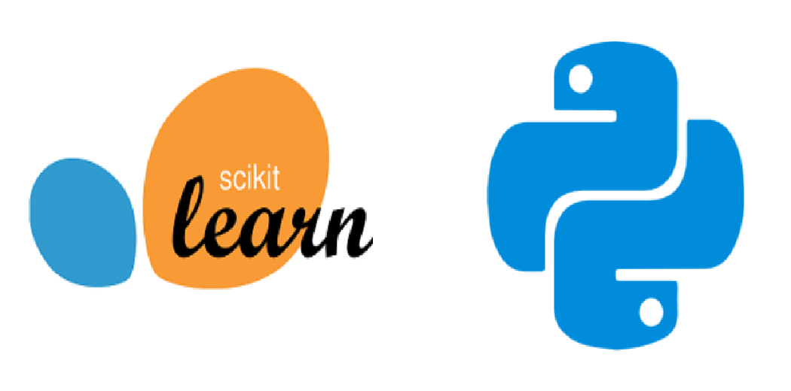
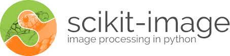

# Retinal-Vessel-Segmentation-Tool

## Data Source

[HRF Image Database](https://www5.cs.fau.de/research/data/fundus-images/)

## Python Library

- Scikit-Learn <br>
  
- Scikit-image <br>
  
- Matplotlib <br>
  

## Segmentation Steps

1. Collect fundus images
1. Get each image label
1. Extract green channel values through RGB fundus images
1. Apply the _Sato tubeness_ filter to detect continuous ridges
1. Extract vessel structures

```python
vessel = filters.apply_hyteresis_threshold(filter_result)
```

6. Collect and save different processing results

## References

1. [Skimage filters](https://scikit-image.org/docs/dev/api/skimage.filters.html?highlight=sato#skimage.filters.sato)
2. [Use pixel graphs to find an object’s geodesic center](https://scikit-image.org/docs/dev/auto_examples/applications/plot_pixel_graphs.html#sphx-glr-auto-examples-applications-plot-pixel-graphs-py)
